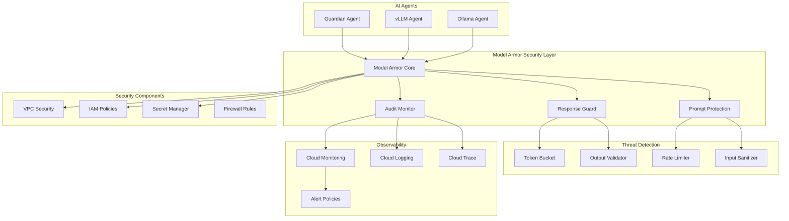

# Model Armor - Security & Observability Shield

## Architecture Overview

## Components

### 1. Prompt Protection
- Input validation and sanitization
- Injection attack prevention
- PII detection and masking
- Rate limiting per user/API key

### 2. Response Guard
- Output filtering for sensitive data
- Hallucination detection
- Content policy enforcement
- Token usage monitoring

### 3. Audit Monitor
- Request/response logging
- Security event tracking
- Performance metrics
- Compliance reporting

### 4. Security Integration
- Google Secret Manager for API keys
- IAM policies for access control
- VPC Service Controls
- Cloud Armor DDoS protection

## Implementation

The Model Armor system provides a security and observability layer for all AI agents in the AgentVerse infrastructure.